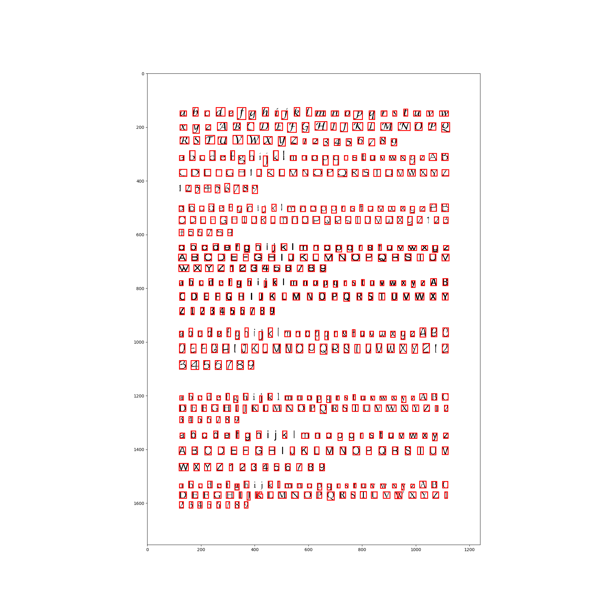

# k-Nearest-Neighbors-Classifier-for-Letters-concept-Ocr
k-Nearest Neighbors Classifier has been used because of its simplicity, fastness and efficiency. The problem with Neural Network based models DNN or CNN required a lot of data, but in out cases we have limited amount of data just around 3 thousand images of characters

Advantages: Simple to understand, fast and efficient
Disadvantages: Need to choose the number of neighbours k

*How can this system be improved?
Increasing the quality and quantity of dataset. And character extraction techniques, the one techniques use in our project quit miss some words, that’s cause floating error as our others numbers are depends on it.

*Is the training appropriate and sufficient, does it overfit or underfit?
The training is sufficient as in Knn training will be not depends on gradient descent or any optimization method so that’s why doesn’t required any epochs. It look like underfit as it is not predicting the right answer.

#### For Training:

	> First Run "Training_images_to_character.py"
	> Second Run "Knn_Training.py". This will train knn for 3 Neairest Neighbors and save model

#### For Testing:

	> Run "Testing_on_Image.py", add the name of the image in the first line.
	  This will run on images and then show the results.

>In testing and training folder Images of characters automatically saved those are detected.

